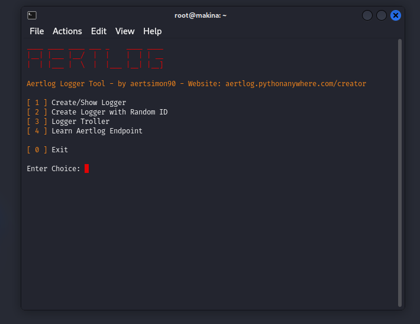

# Aertlog

Aertlog is a free and secure IP Logger service.

## Usage

1. Visit the [Aertlog Creator Website](https://aertlog.pythonanywhere.com/creator).
2. Create a show-url link using a name without spaces.
3. Go to the created show-url link and send any desired link from the 4 links in the content to the target.
4. When the target clicks the link, information related to the target will be logged and displayed below the show-url content.

For more information, please contact us at [aertlogweb@gmail.com](mailto:aertlogweb@gmail.com).

## Aertlog Theme

The Aertlog theme combines red and black colors for a stylish appearance.

---

### About Aertlog

Aertlog is a free and secure IP Logger service that allows you to create show-urls to log information when clicked. It provides a safe and reliable way to track interactions with your links.

**Note:** Please be aware that Aertlog now has the capability to retrieve IP addresses, access cameras, and steal account information through account logins.

To launch Aertlog from the terminal, download this repository and run the `tool.py` file inside.

 
